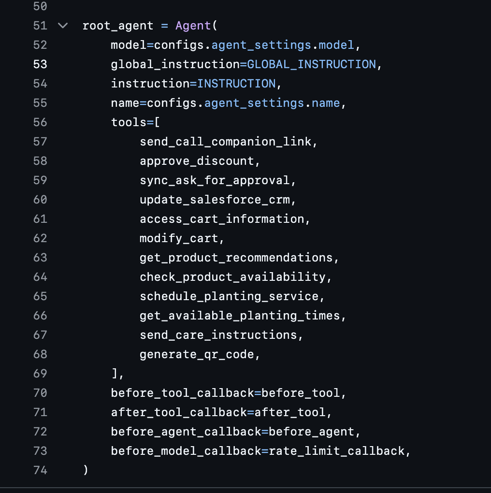

<p align="center">
  
</p>

<h1 align="center">Star</h1>

<p align="center">
  <strong>A statically-typed programming language for cross-language library development</strong>
</p>

---

## The Problem

<table align="center">
  <tr>
    <td></td>
    <td></td>
  </tr>
</table>

The images above show the usage of the Google Agent Development Kit library. If you look closely, the one on the left is Python and the one on the right is Typescript. Their functionality is pretty much the same, but Typescript users can't use the Python library, so Google has to develop a separate SDK for Typescript (and pretty much every other language out there). This means more manpower, more ways for the SDKs to become inconsistent and generally just redundant effort.

## The Solution

What if we could write the SDK once and target a runtime that could run pretty much everywhere. This is the Java philosophy, write once and run anywhere but applied to SDKs. Can we run our SDK code within other languages natively (or at least try to make it feel native)? Star is potential solution to this, where the code you write is compiled to WebAssembly (Wasm). Any language out there that has a Wasm runtime could interface with your Wasm binary. Separately, we could also provide codegen to generate stubs and types that appear in Star in your host language to give that native feel to the SDKs.

## Language Overview

### Syntax

```star
let x: integer = 0;
let y: integer = 1;
let n: integer = 10;

while n > 0 {
    let tmp: integer = x;
    x = y;
    y = tmp + y;
    n = n - 1;
}

for let i: integer = 0; i < 10; i = i + 1; {
    print i;
}

print x;
```

### Type System

The language at its infancy has a very simple type system to cater for the type systems of other languages for portability. You can create structs, errors, strings, lists, dictionaries, integers, floats and booleans. Star uses a tagged union approach for when a value can be null or error. `string?` indicates that your value could be a string or null. `string!` indicates that it could be error and `string?!` means it can be string, error or null.

## Memory Management

### Garbage Collection

Star uses a tri-color GC (not implemented).

## Compilation

Star compiles to WebAssembly, a portable binary format that runs on any platform with a Wasm runtime. This includes browsers, Node.js, Python (via wasmtime/wasmer), Rust, Go, and many other languages.

## Getting Started

### Installation

```bash
git clone https://github.com/kavishsathia/star
cd star
cargo build --release
```

### Running

```bash
cargo run          # Compiles source to output.wasm
cargo run --bin run # Executes the compiled Wasm
```

## Contributing

Contributions are welcome! Please feel free to submit a Pull Request.

## License

This project is licensed under the MIT License.
