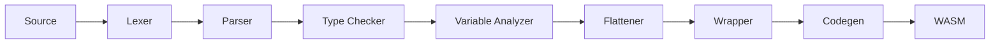
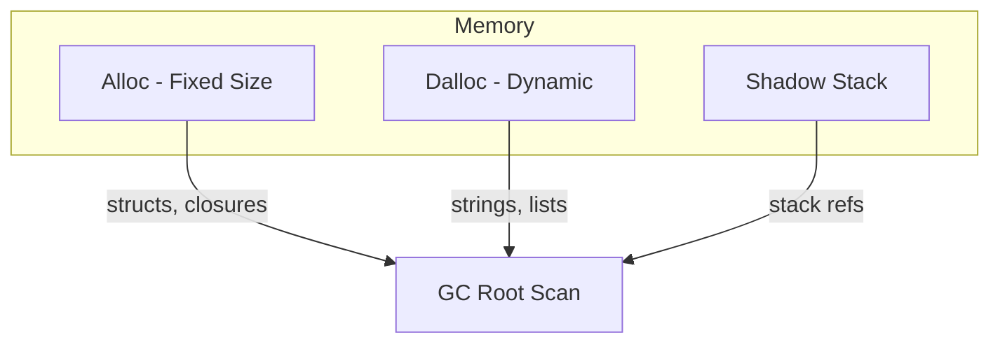

# The Compiler

The compiler is made of 7 passes. I'll briefly cover each one of them.

The first pass is the Lexer, takes the code and breaks it down into tokens.

The second pass is the Parser, takes the tokens, and outputs an abstract syntax tree. Uses a handwritten parser, and Pratt parsing for operator precedence.

The third pass is the Type Checker, takes in an abstract tree and augments it with type information. Now we know the type of every expression and subexpression within the AST.

The fourth pass is the Variable Analyzer, it checks the variables that are locals, and assigns a local index (for use later during WASM generation). Also defines function indices. And identifies free variables and where they originate from.

The fifth pass is the Flattener, WASM only accepts top level functions, so I do closure conversion to store the environment as a struct within the heap, and retrieve it when the function is called. Structs are also rearranged to store pointers at the start.

The sixth pass is the Wrapper (or Caster). We have types that are implicitly casted during runtime, this pass will deal with that.

The seventh and last pass is the Codegen. This one generates WASM to be run.

# Triple Memory Approach

WASM can have multiple memories, I take advantage of this fact to reduce external fragmentation within a single memory where structs that are created and freed quickly create holes within memory that end up not being used by larger chunks like lists and strings. So, one memory is for fixed sized allocations, another memory is for dynamic allocation.

The third memory is for the shadow stack, since we cannot actually access the stack on WASM, we keep a copy on the side so that we know the root when we start marking during GC time.

