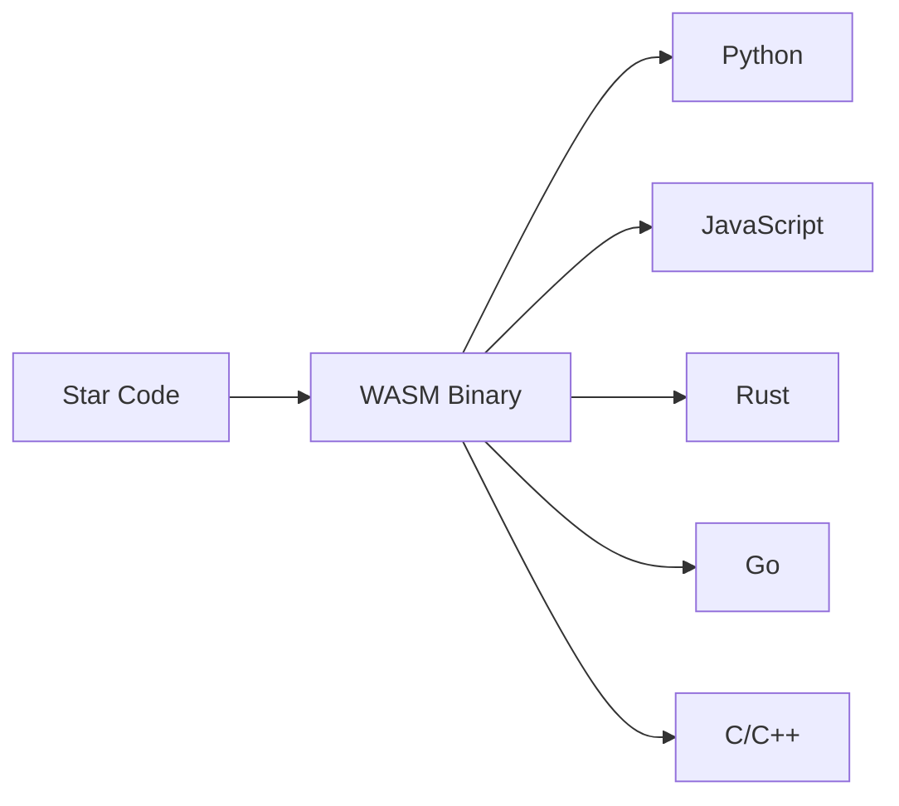

# A Warm Welcome!

Welcome to the developer guide for Star! If you're trying to contribute to the development of Star, you're in the right place. I'll get you up to speed with the goal, architecture, implementation and future plans so that we can start working together as quickly as possible. If you're cool with WebAssembly, you can completely skip this section!

# What is Star?

I'll assume you landed here without an ounce of context on what you're looking at. Star is a programming language that targets WebAssembly, a runtime that has recently been popularised because of its ability to run performant code on the browser. Does Star run on the browser? Yes! In fact, you can run Star on this code panel that you see to your right (or a separate tab on mobile). Even more recently though, there has been a trend where the WebAssembly runtime is implemented in more places, like other programming languages, which allows us to call WebAssembly functions from other languages. Star leverages this to do something cool.

# What problem does it solve?

Imagine being a library developer, you developed a library to abstract away a certain pattern or utility. You made it in Python, that's a great start. But now you want it in Javascript, C, C++, Golang... do you really want to implement this library for all of those targets?

And what if you make a change on the Python codebase, do you also make the same change on all the other codebases?

What if you could write your library once, and call your abstraction from any other language out there? That'd be cool. And that's the goal.

# Enter WASM

WebAssembly is beginning to show progress that could enable this vision. More and more languages are gaining the ability to run WebAssembly binaries, so that the code within the host language can call the functions within WebAssembly. Languages like Rust, C, C++, Golang already compile to WebAssembly, so technically you can call Rust code from your Python code, or your Typescript code. Why then, do we need Star?

# Why Star?

A language built from the ground up for this singular purpose has a few unfair advantages compared to other languages that happen to compile to WebAssembly. The main advantage is with how the type system interacts with the callee. How do we represent Rust's elegant enum system in C? We can do it but it will feel as if it was bolted on. We want that native feel.

Not just that, how do you utilise language specific traits, like the Python Context Manager when you're dealing with the implementation on a separate language? You definitely cannot do this in Rust, C or Golang. We need a purpose built language to enable this.
